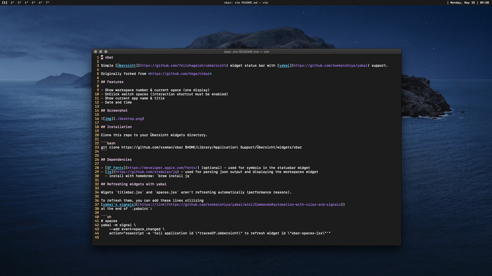

# xbar

Simple [Übersicht](https://github.com/felixhageloh/uebersicht) widget status bar with [yabai](https://github.com/koekeishiya/yabai) support.

Originally forked from <https://github.com/kkga/nibar>

## Screenshot



## Installation

Clone this repo to your Übersicht widgets directory.

```bash
git clone https://github.com/xseman/xbar $HOME/Library/Application\ Support/Übersicht/widgets/xbar
```

## Dependencies

- [SF Fonts](https://developer.apple.com/fonts/) (optional) — used for symbols in the statusbar widget
- [jq](https://github.com/stedolan/jq) — used for parsing json output and displaying the workspaces widget
  - install with homebrew: `brew install jq`

## Usage

### Refreshing yabai workspaces widget

The widget `spaces.jsx` for displaying yabai workspaces aren't refreshing automatically.

To refresh them add to `.config/yabai/yabairc`

```sh
yabai -m signal --add event=space_changed action="osascript -e 'tell application id \"tracesOf.Uebersicht\" to refresh widget id \"xbar-spaces-jsx\"'"
```

### Refreshing yabai titlebar widget

The widget `titlebar.jsx` for displaying title of focused window isn't refreshing automatically.

To refresh it add to `.config/yabai/yabairc`

```sh
yabai -m signal --add event=application_front_switched action="osascript -e 'tell application id \"tracesOf.Uebersicht\" to refresh widget id \"xbar-titlebar-jsx\"'"

yabai -m signal --add event=window_title_changed action="osascript -e 'tell application id \"tracesOf.Uebersicht\" to refresh widget id \"xbar-titlebar-jsx\"'"
```
